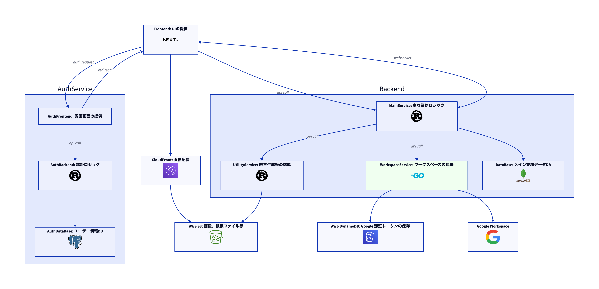

# OISM -- PH 店舗管理システム WorkspaceService

## システム概要

OSIM は EC ショップのバックオフィスに必要な機能をまとめて提供するサービスです。

### 主な機能

以下機能が含まれています

#### 注文管理

- 注文の受付
- 注文の状態管理

#### 在庫管理

- 入庫・出庫
- 履歴管理
- 倉庫間移動

#### 出荷管理

- 出荷の作成生
- 輸送ベンダー管理
- 輸送帳票生成

#### コラボレーション

- 複数ユーザ
- ユーザー間のリアルタイム情報更新

#### 外部連携

- Google Workspace への通知
- Google Workspace へのタスク割り当て

## システム構成

\*\* 図 Backend:WorkspaceService 部分が本プロジェクト



## Development

### Requirement

- メインデータベースの起動が必要。

- [just](https://github.com/casey/just)のインストールが必要

### Dev サーバー起動

```sh
just start
```

### 構造図生成

```sh
just generate-structure
```

### Runtime 環境変数

`AWS_ACCESS_KEY_ID`: DynamoDB AWS のアクセスキー
`AWS_SECRET_ACCESS_KEY`: DynamoDB AWS のシークレットアクセスキー

### プロジェクトのコンフィグレーション

`google_service_configurations/`フォルダー内の`config.yaml`ファイルを読み込む。

以下が設定変数:
`webhooks_url`: Google Chat への通知用 Webhook URL
`dynamoDb_table_name`: Google OAuth2 Token の DynamoDB テーブル名
`app_port`: アプリケーションのポート番号

また、GCP のアプリケーション認証情報を`google_service_configurations/`フォルダー内に`credentials.json`という名前で保存する。
